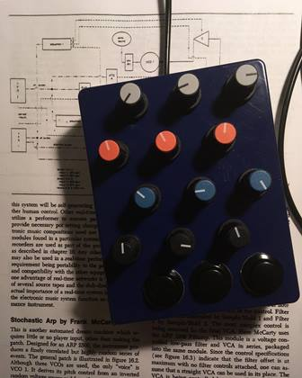

Teensy 3.2 code for a simple 12 knob, 3 button midi controller.

- Hardware
    - teensy 3.2 board
    - 12 10K linear pots
    - 3 momentary on arcade style buttons
- Wiring knobs
    + With pot pins facing down:
        + Connect rightmost leg to AGND.
        + Connect leftmost leg to 3.3V.
        + Connect middle leg to A0 pin.
        + Et voila, voltage divider across Teensy analog pin. Rinse and repeat for pins A0-A11.
- Wiring buttons
    + Connect switch lugs to AGND, digi pins 0-2.

Space PCB mount Alpha pots (or similiar) evenly on perfboard, and use attached drill guide to drill a hammond 1590BBS enclosure to mount the pot board easily inside the enclosure.

Install the buttons_knobs.ino firmware using the arduino development environment.

